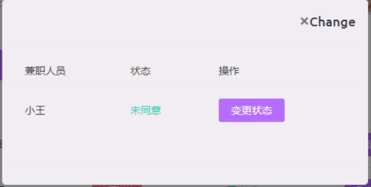

# 兼职管理系统

###技术选型

- springboot +jquery +bootstrap

### 使用方法

1. 导入sql

2. Application.properties中配置的Mysql数据库用户名为root，密码123，若用户名密码不同，请自行修改

 

3. 启动程序：执行springboot的main函数

 

###登录注册

#### 注册

- 注册页面

 

第一个选择框这里可以选择注册人的类型。

注册完成后，可以直接选择登录。

####登录页面

 

- 若该账户密码不正确则出现弹框：

 

- 用户不存在：

 

###辅导员管理界面

 

####添加学生信息

- 该界面可以对学生信息进行增加，修改，删除。若新增的学生未注册，则显示未注册。
- 若学生已经注册，且进行过兼职，则可以点击历史兼职情况查看兼职。

 

- 点击新增即可添加一名学生

 

####修改学生信息

 

####删除

 

####查看兼职信息

 

####查看兼职

- 点击左侧的查看兼职即可查看兼职

 ####删除兼职

- 若发布的兼职不符合规定，可以删除它。

 

## **介绍人管理**

辅导员可对兼职介绍人管理

 

- 只有被辅导员审核通过的才能发布兼职信息。

 

###兼职介绍人

####发布兼职

 

该页面为发布的兼职历史信息，可以在该页面对兼职进行管理。

####新增

 

 

- 点击新增按钮可发布兼职信息。

####查看详情

 

 

####查看兼职人员

 

 

点击变更状态可以选择是否同意学生兼职。

###学生

####兼职状况

 

该页面显示的是学生已经申请的兼职。

####查看详情

点击查看详情

 

####评价

 

- 可以为本次兼职进行评分。

####查看兼职

 

- 在该页面可以查看所有被辅导员审核通过的兼职信息。